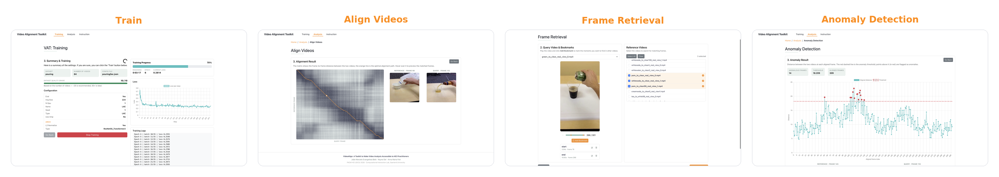

# VideoAlign

**A toolkit to make self-supervised video alignment accessible. Train an encoder on your own
videos, then align, search, and analyze them, all from a simple web app.**

VideoAlign lets practitioners *without* machine-learning expertise train video-alignment models
and use them for three downstream tasks: **video alignment**, **frame retrieval**, and
**anomaly detection**.
It implements TCN, TCC, LAV, GTA, CARL/SCL, and the toolkit's own **LAC** (Local-Alignment
Contrastive) loss.



---

## Features

- **Train** an encoder by aligning videos of the same activity — no manual labels needed.
- **Align Videos** — line up two vixwdeos frame-by-frame with an interactive distance matrix.
- **Frame Retrieval** — find the frames in other videos that match key moments of a video.
- **Anomaly Detection** — automatically flag frames that deviate from a correct reference.
- **GUI + API** — point-and-click workflows in the browser, plus HTTP endpoints for integration.

---

## Requirements

- [Conda](https://docs.conda.io/) (Miniconda or Anaconda)
- [Node.js](https://nodejs.org/) ≥ 18 and npm
- Git
- A CUDA GPU is recommended for training (CPU works for light/evaluation use)

---

## Quick start

**1. Get the code** (with the model submodule)

```bash
git clone https://github.com/CIXUniSaarland/video-alignment-toolkit.git
cd video-alignment-toolkit
git submodule update --init lac
```

**2. Start the backend** — the API server (port 5001)

```bash
cd src/server
conda env create -f env.yml      # first time only
conda activate lac
pip install -r requirements.txt  # first time only
python server.py
```

**3. Start the frontend** — the web app (port 3000), in a **new terminal**

```bash
cd src/gui
npm install                      # first time only
npm start
```

**4. Open the app** → <http://localhost:3000>

The web app talks to the backend automatically. Once both are running, you're ready to go.

---

## Datasets

Place datasets at the repo root under `datasets/<name>/`. **Every video must be an `.mp4` file
inside a `videos/` subfolder** — the toolkit only looks there, and only `.mp4` is supported.
Training and evaluation additionally use `train.pkl` / `val.pkl`:

```
datasets/
└── pouring/
    ├── videos/          # required — put all clips here
    │   ├── clip01.mp4   # must be .mp4
    │   ├── clip02.mp4
    │   └── ...
    ├── train.pkl        # training / evaluation only
    └── val.pkl
```

For Analysis (Align, Frame Retrieval, Anomaly), only the `videos/*.mp4` files are needed — the
`.pkl` files are not required.

Example datasets:
[Pouring](https://drive.google.com/file/d/14xjBRqx2xtyO0rXU2RVYGdFxyWS_Qkv5/view) ·
[PennAction](https://drive.google.com/file/d/1lcqHYciO68M7LVniJuZ5oOr6hsOuOPuT/view) ·
[Jester](https://www.qualcomm.com/developer/software/jester-dataset) (hand gestures)

**Jester** is supported as a built-in `Jester` dataset type, but it ships as per-clip folders of
JPEG frames rather than mp4s. Convert it first with the helper in [`jester/`](jester/) where it encodes
one gesture into `datasets/jester/videos/*.mp4`, after which you train it like any other dataset
(select it in the GUI with the `jester/lac.json` config). See [`jester/README.md`](jester/README.md).

---

## Models

Trained models live at the repo root under `train-results/<run-name>/`. The GUI's **working
directory** for Analysis defaults to `../train-results`, and a folder only shows up as a loadable
model if it contains a **`config.json`**. Each run folder looks like this:

```
train-results/
└── pouring-24-06-2026/        # one folder per trained model
    ├── config.json            # required — defines the architecture and loss type
    └── models/                # required — checkpoints live here
        └── LAC-ckpt_epoch_9.pth
```

Checkpoint files must:

- be **`.pth`** PyTorch checkpoints (a dict with `model_state_dict`), and
- be named **`<TYPE>-ckpt_epoch_<N>.pth`**, where `<TYPE>` matches the `type` in `config.json`
  (e.g. `LAC`, `SCL`, `TCC`, `TCN`, `LAV`, `GTA`).

When loading, the toolkit picks the checkpoint with the **highest epoch number**. The `embeddings/`
and `output/` subfolders are created automatically (cached embeddings and results) — you don't add
them yourself. To bring in your own model, drop a folder with this layout into `train-results/`.

---

## Using the toolkit

The typical workflow is **train a model, then analyze videos with it**:

1. **Train** — in the *Training* tab, pick a dataset and train an encoder.
2. **Analyze** — in the *Analysis* tab, select your trained model and a pair (or set) of videos.

For step-by-step walkthroughs of every tool, open the **Instructions** tab inside the app. It
covers Training, Align Videos, Frame Retrieval, and Anomaly Detection with screenshots.

---

## Project structure

```
video-alignment-toolkit/
├── lac/             # git submodule: the LAC research core (models, datasets, training)
├── src/
│   ├── gui/         # React web app
│   └── server/      # Flask API
├── datasets/        # your datasets (one folder per dataset)
└── train-results/   # trained models, logs, and checkpoints
```

To train from the command line instead of the GUI:

```bash
cd lac
conda activate lac
python train.py --config='config/pouring/lac.json'
```

---

## Citation

If you use VideoAlign in your research, please cite:

> João Marcelo Evangelista Belo, Keyne Oei, and Anna Maria Feit. 2026.
> *VideoAlign: A Toolkit to Make Video Analysis Accessible to HCI Practitioners.*
> Proceedings of the ACM on Human-Computer Interaction (PACM HCI), EICS. ACM.

```bibtex
@article{belo2026videoalign,
  title     = {VideoAlign: A Toolkit to Make Video Analysis Accessible to HCI Practitioners},
  author    = {Belo, Jo\~{a}o Marcelo Evangelista and Oei, Keyne and Feit, Anna Maria},
  journal   = {Proceedings of the ACM on Human-Computer Interaction (PACM HCI)},
  series    = {EICS},
  year      = {2026},
  publisher = {ACM}
}
```

*Computational Interaction Lab, Saarland University.*
